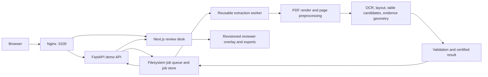

# PP Table Magic (GMoney V2) — Engineering Handoff

**Audience:** engineers onboarding to the Table Magic work

**Status checked:** 2026-09-23

**Repository baseline inspected:** `main` at `78c3547` (`Record failed M5 curved-flat GPU pilot`, 2026-09-08)

## 1. What we are building

GMoney V2 extracts itemized rows and financial fields from multi-page hospital bills and lets a reviewer inspect and correct the result against the original page evidence. “PP” refers to the PaddlePaddle OCR, layout, and table-understanding components used or evaluated by the system.

Table Magic is the accuracy and evidence-geometry roadmap for difficult tables, especially tables on curved, folded, or wavy photographed pages. The intended design keeps GMoney’s deterministic reconstruction as the primary path. New image transforms and table extractors are candidates: run them in shadow, preserve their lineage, compare them on frozen cohorts, and promote only after they meet accuracy and evidence gates. Table Magic is not a replacement extractor and must not invent financial values or weaken evidence grounding.

The active product in this checkout is the evidence-review demo. It is a useful end-to-end application, but it is not the original planned PostgreSQL/Temporal production platform and is not a production PHI system.

## 2. Current status and next work

The latest recorded Table Magic review is the M5 GPU pilot from 2026-09-08. Treat these as the latest repository evidence, not as a claim that a live deployment or external corpus was checked today.

| Milestone | State in the latest evidence | Meaning |
| --- | --- | --- |
| M0 baseline and labels | In progress | Frozen cohort baselines and audited labels are incomplete. |
| M1 canonical-image consistency | In progress | Code is present; the frozen non-regression gate remains pending. |
| M2 artifact/evidence V6 | In progress, held | Integrity work is present, but the authority-bound accuracy gate is not sealed. |
| M3 dense transforms | Promoted | V6 can store and validate dense mappings; this does not activate UVDoc. |
| M4 UVDoc feasibility | Held | GPU integration and grid replay work; curved gain and flat non-regression did not pass. |
| M5 per-table selection | Candidate rejected; no promotion | The pilot selector chose UVDoc on flat tables and regressed critical metrics. |
| M6–M10 | Not started | Table V2, Paddle OCR-VL A/B, targeted recovery, fusion, and native-PDF routes remain future work. |
| M11 learned ranker | Blocked | The current corpus is too small for training or calibration. |

### M5 pilot result

The isolated pilot ran one audited curved bill and one audited flat bill twice each. Geometry replay, V6 validation, and deterministic table identities passed. The selector retained the raw/oriented reconstruction for the curved tables but selected UVDoc for the already-flat tables, which were visibly warped and clipped.

The frozen v2 pilot report showed pooled critical precision/recall falling from `100.00% / 82.98%` to `48.72% / 40.43%`. A later evaluator fix (`authority_metrics_v3`, commit `259b4cc`) bounded per-document critical counts; its post-pilot diagnostic was `36/39/47` for baseline (`92.31%` precision, `76.60%` recall) and `16/39/47` for candidate (`41.03%` precision, `34.04%` recall). The corrected diagnostic is not a replacement for the preregistered v2 result and is not an authority-sealed promotion report. Both results reject this candidate.

### Recommended next steps

1. Complete the exact 159-document authority inventory with real eligible PDFs, nested `production14`, `passing36`, and `staging159` cohort membership, four isolated reviews per document, audited gold, and a frozen evaluator identity. The latest readiness report recorded 152 eligible documents, seven genuine documents still missing, and the required reviews and cohort assignment incomplete. Synthetic padding is prohibited.
2. Seal the corrected evaluator and a fresh baseline, including two identical `passing36` replays. Use those same immutable identities to resolve the M0, M1, M2, and M4 authority/accuracy gates; M3 is already promoted.
3. Change the M5 candidate policy so flat pages abstain or keep the baseline. Re-register the candidate and run two deterministic shadow replays across all three cohorts.
4. Promote M5 only if no tables are lost or duplicated, ambiguous matches abstain, flat and critical floors hold, all release floors pass, and the preregistered curved-table improvement is demonstrated. Keep production selection off until then.
5. After M5 passes, proceed to M6 TableRecognitionPipelineV2 and M7 PaddleOCR-VL A/B as separate, measured candidates. Continue to defer general fusion and learned ranking until corpus evidence supports them.

The authoritative roadmap and detailed evidence are in [tableMagic.md](../tableMagic.md), [the M5 review](reviews/table-magic-m5.md), [the M4 review](reviews/table-magic-m4.md), [the M3 review](reviews/table-magic-m3.md), and [the authority orchestration review](reviews/table-magic-authority-orchestration-2026-09-07.md). The M2 hold is documented in [the M2 review](reviews/table-magic-m2.md).

## 3. Architecture

### Current end-to-end demo



- **API and storage:** `src/gmoney/demo/api.py` exposes upload, status/history, page/evidence, rows/source tables, review, approval, and export routes. `src/gmoney/demo/store.py` persists jobs and queue state on the filesystem; reviewer changes are revisioned overlays, separate from immutable machine output.
- **Worker:** `src/gmoney/demo/worker.py` recovers queued work, runs reusable processes, records progress/health, and invokes the file-backed extraction flow. `GMONEY_WORKER_CONCURRENCY` controls the worker lanes; the GPU profile defaults to one because Paddle and the VLM share a T4.
- **Extraction:** `src/gmoney/extraction/offline.py` orchestrates PDF page rendering, preprocessing candidates, OCR/layout, table proposals, row construction, normalization, evidence, and validation. `src/gmoney/inference/paddle.py` and `src/gmoney/inference/ocr_table_fallback.py` contain Paddle paths; `src/gmoney/inference/uvdoc.py` implements the UVDoc adapter. The local PaddleOCR-VL 1.6 GGUF model is served by llama.cpp and reached through `GMONEY_VL_URL`.
- **Table matching and geometry:** `src/gmoney/extraction/table_selection.py` matches proposals in source-page space and assigns stable logical-table identities. `src/gmoney/geometry/` maps coordinates and renders diagnostics. Dense mapping storage, V6 artifacts, evidence, and M5 shadow contracts live in `src/gmoney/contracts/evidence.py` and `src/gmoney/contracts/v6.py`.
- **Review UI:** `frontend/app/page.tsx` implements the shared queue and evidence desk. Nginx serves the UI and proxies API paths.
- **Evaluation:** `src/gmoney/evaluation/authority_metrics.py`, `uvdoc_authority.py`, `release_gate.py`, and `m5_shadow.py` implement authority metrics, candidate gates, release certification, and shadow projection evaluation.

The current demo does not use PostgreSQL or Temporal for its product workflow. The root [compose.yaml](../compose.yaml) starts PostgreSQL, MinIO, Temporal, and a minimal base API readiness app; it is a foundation scaffold, not the complete review demo. Use `compose.demo.yaml` for the end-to-end product and add `compose.gpu.yaml` for the GPU worker/model profile.

### Extraction and evidence flow

1. The API validates and records an uploaded PDF in the filesystem job store.
2. The worker renders pages and creates page/preprocessing artifacts with explicit coordinate transforms.
3. OCR/layout and table candidates are processed into source tables, canonical rows, typed values, and per-field/page evidence. Optional routes may produce shadow candidates.
4. Validation checks structure, values, completeness, lineage, and evidence. A result needing human attention remains reviewable; reviewer changes are stored separately with revisions.
5. The UI displays the original page alongside extracted rows. Approval and exports are guarded by review and validation eligibility.

V6 adds artifact lineage and dense transform contracts while retaining V5 read compatibility. Source-page coordinates remain the authority for visible evidence. A UVDoc image or M5 winner recorded in shadow must not become the published crop, token source, or evidence owner before its promotion gates pass.

### Repository map

| Area | Location |
| --- | --- |
| Product and engineering gates | [README](../README.md), [IMPLEMENTATION_PLAN.md](../IMPLEMENTATION_PLAN.md), [tableMagic.md](../tableMagic.md) |
| Demo API, worker, store, review | `src/gmoney/demo/` |
| Extraction and table selection | `src/gmoney/extraction/` |
| Paddle, Gemini, UVDoc adapters | `src/gmoney/inference/` |
| Geometry and V6 evidence contracts | `src/gmoney/geometry/`, `src/gmoney/contracts/` |
| Metrics, authority, release gates | `src/gmoney/evaluation/` |
| Browser application | `frontend/` |
| Local/demo/GPU Compose | `compose.demo.yaml`, `compose.gpu.yaml`, `compose.canary.yaml` |
| GPU operational runbook | [GPU demo deployment](GPU_DEMO_DEPLOYMENT.md) |
| Milestone decisions | `docs/reviews/table-magic-*.md` |
| Test suite | `tests/`, `frontend/app/*.test.tsx`, `frontend/lib/*.test.ts` |

## 4. Run and develop

### Requirements and Python checks

Python is supported at `>=3.11,<3.13`; CI uses Python 3.12. The normal development extra is enough for the backend tests and tools:

```bash
python3 -m venv .venv
.venv/bin/pip install -e '.[dev]'
.venv/bin/pytest
.venv/bin/ruff check .
```

Frontend checks use Node 22, as in the Dockerfile:

```bash
npm ci --prefix frontend
npm --prefix frontend test
npm --prefix frontend run lint
npm --prefix frontend run typecheck
npm --prefix frontend run build
```

Validate all Compose variants with `make compose-config`. CI currently runs Ruff, pytest, and the base Compose config; the milestone reviews additionally record frontend and demo/GPU/admin Compose checks.

### Start the CPU demo

The demo Compose file expects the PaddleOCR-VL files in `/home/azureuser/gmoneyv2-runtime/model-cache/paddleocr-vl-1.6` and uses `/home/azureuser/gmoneyv2-runtime` for job/config data by default. Create those host directories with write access for container UID/GID `10001:10001`. If using different locations, review the host bind mounts in `compose.demo.yaml`; the CPU file currently hard-codes its model-cache mount.

The download helper needs `huggingface-hub` available in the Python environment. It fetches both GGUF files from `PaddlePaddle/PaddleOCR-VL-1.6-GGUF`:

```bash
.venv/bin/pip install 'huggingface-hub>=1,<2'
.venv/bin/python scripts/download_paddleocr_vl.py \
  --output /home/azureuser/gmoneyv2-runtime/model-cache/paddleocr-vl-1.6
```

Then build and start the stack:

```bash
GMONEY_IMAGE_TAG="$(git rev-parse --short=12 HEAD)" \
  docker compose -f compose.demo.yaml up -d --build
```

Open `http://localhost:3100`. The readiness endpoint is `http://127.0.0.1:3100/api/v2/health/ready`; the API is also bound to loopback at `127.0.0.1:8100`, and PaddleOCR-VL at `127.0.0.1:8111`. Useful commands:

```bash
docker compose -f compose.demo.yaml ps
docker compose -f compose.demo.yaml logs -f api worker paddleocr-vl frontend nginx
docker compose -f compose.demo.yaml down
```

Job files and model caches use host bind mounts. Do not use `down -v` as routine cleanup; it is unnecessary for these mounts and can remove named state if the Compose definition changes.

### Start or release on GPU

Use an NVIDIA-enabled host with the supported driver and container toolkit. GPU Compose installs the CUDA Paddle worker, pins the CUDA llama.cpp image, selects `gpu:0` and `cuda:0`, requires a full Git revision, and defaults to one worker/VLM slot. Model files must be present under the configured `GMONEY_MODEL_ROOT`; use `scripts/download_paddleocr_vl.py` for the VLM and the version-pinned `scripts/download_uvdoc.py` only for isolated UVDoc evaluation.

The exact release flow includes revision attestation, rollback capture, runtime permissions, health checks, and a frozen 14/36/159 corpus gate. Follow [docs/GPU_DEMO_DEPLOYMENT.md](GPU_DEMO_DEPLOYMENT.md) for those commands rather than treating a successful container startup as release certification. Keep at least the configured 10 GiB disk floor on the documented T4 host.

## 5. Operating constraints and useful references

- **Promotion switches:** `GMONEY_TABLE_SELECTION_MODE` and `GMONEY_UVDOC_MODE` default to `off`. Use `shadow` only in an isolated candidate stack. `enabled` must remain rejected until the corresponding authority-bound promotion is sealed.
- **Demo boundary:** the public demo is unauthenticated plain HTTP. It is for time-limited demonstration only, not production PHI. Do not upload patient bills to a machine or service that has not been explicitly approved for that use.
- **Data boundary:** real PDFs, page renders, model weights, runtime jobs, gold labels, and benchmark artifacts belong outside Git. The tracked corpus files are manifests/fixtures; the authoritative corpus and audit evidence are external and must be accessed through the project owner.
- **Evaluation discipline:** use frozen input hashes, gold/evaluator/baseline identities, two deterministic replays, and cohort-level results. Visual readability or a successful GPU run alone is not an accuracy promotion.
- **Current status source:** use the milestone reviews and roadmap as the decision record. The top-level roadmap header predates the M5 pilot, so read its M4/M5 sections and dated reviews for the latest decision.

Useful starting points are [the overall implementation plan](../IMPLEMENTATION_PLAN.md), [the Table Magic roadmap](../tableMagic.md), [M5 pilot review](reviews/table-magic-m5.md), and [GPU deployment runbook](GPU_DEMO_DEPLOYMENT.md).
